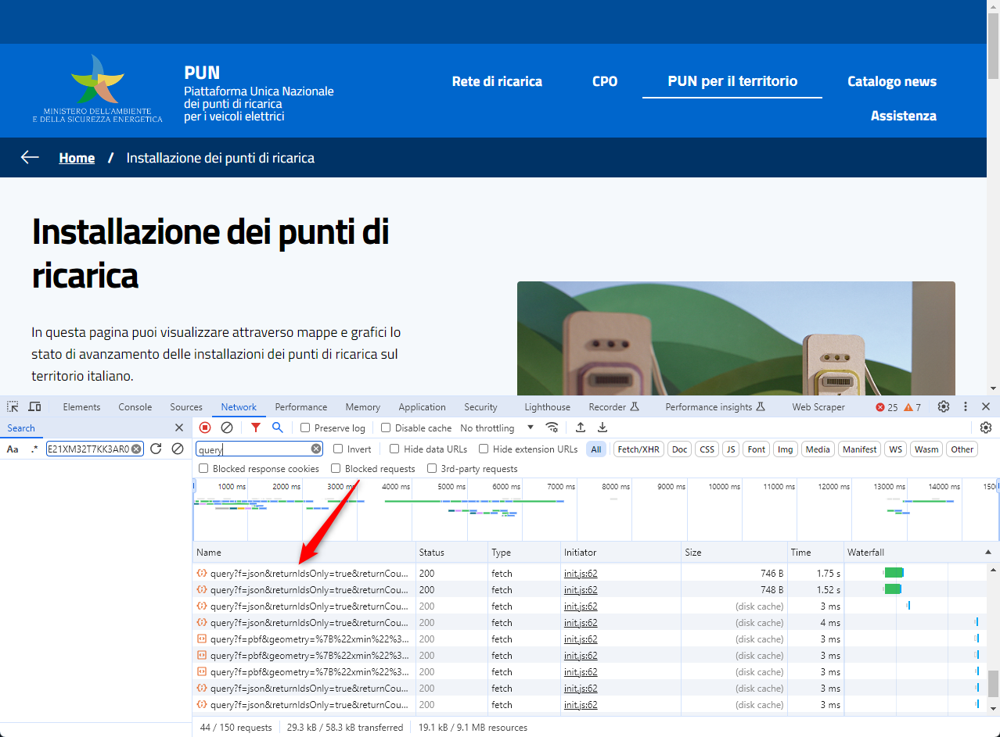

# Intro

A fine marzo 2024 è stata messa online la [**Piattaforma Unica Nazionale dei punti di ricarica per i veicoli elettrici**](https://www.piattaformaunicanazionale.it/), in cui sono visualizzabili su mappa o in elenchi - e **non anche come dati grezzi e aperti** - i punti di ricarica per veicoli elettrici presenti in Italia.

Lo saranno in futuro? Non è dato saperlo, ma è molto probabile che avvenga, perché lo prevedono le norme e lo raccomanda il buon senso. 
Abbiamo fatto una segnalazione in tal senso al [**Difensore Civico per il Digitale**](https://ondata.github.io/guida-diritti-cittadinanza-digitali/parte-seconda/tutela-dei-diritti/).

➡️ Finché le [API](#le-api) saranno accessibili aggiorneremo i dati nella cartella [`data`](data).

Nota bene: nei dati sorgente c'è un problema di codifica dei caratteri (evidente con i caratteri accentati).

[`feed RSS aggiornamento dati`](https://github.com/ondata/rete_ricarica_veicoli_elettrici/commits/main/data/rete_ricarica_veicoli_elettrici.csv.atom)

## Le API

Navigando il sito della [**Piattaforma Unica Nazionale dei punti di ricarica per i veicoli elettrici**] con un _browser_ (vedi immagine sotto), si legge che i dati sono esposti tramite API.

In particolare, leggendo gli URL delle API, si vede che si tratta di un *ArcGIS REST Service*, che sono direttamente e comodamente leggibili con [**GDAL/OGR**](https://gdal.org/drivers/vector/esrijson.html).

## Chi ha usato questi dati

- il POST, [**Dove ricaricare l’auto elettrica in Italia**](https://www.ilpost.it/2024/03/29/mappa-colonnine-ricarica-auto-elettriche/);
- Gianni Vitrano, [**Italia | Punti di ricarica per i veicoli elettrici**](https://umap.openstreetmap.fr/en/map/italia-punti-di-ricarica-per-i-veicoli-elettrici_1046714)
- Guenter Richter, [**Una mappa per esplorare i dati del PUN**](https://gjrichter.github.io/pages/PUN/)
